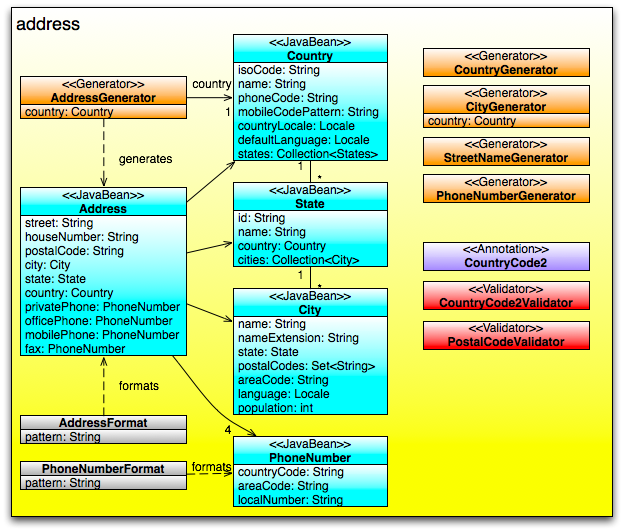
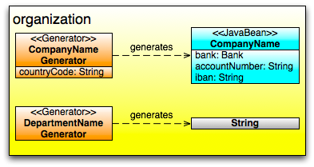

# Domains

benerator domains are a vehicle for defining, bundling and reusing domain specific data generation, e.g. for personal data, addresses, internet,
banking, telecom. They may be localized to specific languages and be grouped to hierarchical datasets, e.g. for continents, countries and regions.

benerator comes packaged with several domains that have simple implementation of specific data generation and may serve as a base for deriving own
specific data generation domains:

* **person**: Data related to a person

* **address**: Data related to contacting a person by post

* **net**: Internet and network related data

* **finance**: finance data

* **organization**: Organization data

* **product**: Product-related data

## person domain

The person domain has three major components:

* PersonGenerator: Generates Person beans

* AcademicTitleGenerator: Generates academic titles

* NobilityTitleGenerator: Generates nobility titles

* GivenNameGenerator: Generates given names

* FamilyNameGenerator: Generates family names

* BirthDateGenerator: Generates birth dates

* GenderGenerator: Generates Gender values

* EmailAddressGenerator: Generates Email addresses

* GenderConverter: Converts Gender values to predefined strings

* TIN: Marks a Java attribute or property as a European Tax Identification Number

* TINGenerator: Creates European Tax Identification Numbers

* TINValidator: Validates European Tax Identification Numbers

### PersonGenerator

Creates Person beans to be used for prototype-based data generation. It can be configured with dataset and locale property. The generated Person
JavaBeans exhibits the properties salutation, title (both locale-dependend), givenName, familyName (both dataset-dependent), gender and birthDate. If
the chosen dataset definition provides name weights, benerator generates person names according to their statistical probability. Of course, gender,
salutation and givenName are consistent.

You can use the PersonGenerator like this:

`<import domains="person"/>`

`<generate type="user" count="5" consumer="ConsoleExporter">`

`<variable name="person" generator="PersonGenerator" dataset="FR" locale="fr"/>`

`<attribute name="salutation" source="person.salutation" />` `<attribute name="name" script="{person.givenName +' '+ person.familyName}}" />`

`</generate>`

to get output similar to this:

user[salutation=Mr, name=David Morel]

user[salutation=Mr, name=Robert Robert]

user[salutation=Mr, name=Eric Morel]

user[salutation=Mr, name=Patrick Lefebvre]

user[salutation=Mme, name=Helene Fournier]

### PersonGenerator Properties

The PersonGenerator can be configured with several properties:

| Property | Description | Default Value |
| --- | --- | --- |
| dataset | Either a region name or the two-letter-ISO-code of a country, e.g. US for the USA. See

Region Nesting

. | The user's default country | | locale | Two-letter-ISO-code of the language in which to create salutation and titles, e.g. en for English | The
user's default language | | minAgeYears | The minimum age of generated persons | 15 | | maxAgeYears | The maximum age of generated persons | 105 | |
femaleQuota | The quota of generated women (1 → 100%) | 0.5 | | nobleQuota | The quota of generated noble persons (1 → 100%) | 0.005 |

### Person Class

The Person class has the following properties:

| property name | type | property description |
| --- | --- | --- |
| salutation | String | Salutation (e.g. Mr/Mrs) |
| academicTitle | String | Academic title (e.g. Dr) |
| nobilityTitle | String | Nobility title (like Duke) |
| givenName | String | Given name ('first name' in western countries) |
| secondGivenName | String | An eventual second given name |
| familyName | String | Family name ('surname' in western countries) |
| gender | Gender | Gender (MALE or FEMALE) |
| birthDate | Date | Birth date |
| email | String | eMail address |
| locale | Locale | Language of the person instance (used e.g. for salutation) |

### Supported countries

| country | code | remarks |
| --- | --- | --- |
| Austria | AT | most common 120 given names with absolute weight, most common 40 family names with absolute weight |
| Australia | AU | most common 40 given names (unweighted), most common 20 family names with absolute weight |
| Brazil | BR | most common 100 given names (unweighted), most common 29 family names (unweighted) |
| Canada | CA | most common 80 given names (unweighted), most common 20 family names (unweighted). No coupling between given name locale and family name locale |
| Switzerland | CH | most common 30 given names with absolute weight, most common 20 family names with absolute weight |
| Czech Republic | CZ | most common 20 given names with absolute weight, most common 20 family names with absolute weight. Female surnames are supported. |
| Spain | ES | most common 40 given names (unweighted), most common 40 family names with absolute weight |
| Finland | FI | most common 785 given names (unweighted), most common 448 family names (unweighted) |
| France | FR | most common 100 given names (unweighted), most common 25 family names with relative weight |
| Germany | DE | most common 1998 given names with absolute weight, most common 3421 family names with absolute weight2 |
| Israel | IL | 264 given names (unweighted), most common 30 family names with relative weight |
| India | IN | most common 155 given names (unweighted), most common 50 family names (unweighted) |
| Italy | IT | most common 60 given names (unweighted), most common 20 family names (unweighted) |
| Japan | JP | Kanji letters. Most common 109 given names (unweighted), most common 50 family names with absolute weight |
| Netherlands | NL | 3228 given names (unweighted), most common 10 family names with absolute weight |
| Norway | NO | most common 300 given names (unweighted), most common 100 family names with absolute weight |
| Poland | PL | most common 67 given names with absolute weight, most common 20,000 family names with absolute weight. Female surnames are supported. |
| Russia | RU | Cyrillic letters. Most common 33 given names with relative weight, most common 20 family names with relative weight. Female surnames are supported. |
| Sweden | SE | 779 given names (unweighted), most common 22 family names with relative weight |
| Turkey | TR | 1077 given names (unweighted), 37 family names (unweighted) |
| United Kingdom | GB | most common 20 given (unweighted), most common 25 family names (unweighted) |
| USA | US | most common 600 given names and most common 1000 family names both with absolute weight |

## Address domain

* **AddressGenerator**: Generates addresses that match simple validity checks: The City exists, the ZIP code matches and the phone number area codes
  are right. The street names are random, so most addresses will not stand validation of real existence.

* **PhoneNumberGenerator**: Generates land line telephone numbers for a country

* **MobilePhoneNumberGenerator**: Generates mobile phone numbers for a country

* **CountryGenerator**: Generates countries

* **CountryCode2**: Annotation that marks a Java attribute or property as ISO-3166-1 alpha-2 code

* **CountryCode2Validator**: Java Bean Validation ConstraintValidator for ISO-3166-1 alpha-2 codes

* **CityGenerator**: Generates Cities for a given country

* **StreetNameGenerator**: Generates street names for a given country

* **PostalCodeValidator**: Validates if a given postal code is valid in a given country

The following countries are supported:

| country | code | remarks |
| --- | --- | --- |
| Germany | DE | Valid ZIP codes and area codes, no assurance that the street exists in this city or the local phone number has the appropriate length |
| USA | US | Valid ZIP codes and area codes, no assurance that the street exists in this city. |
| Brazil | BR | Valid ZIP codes and area codes, no assurance that the street exists in this city or the local phone number has the appropriate length |

## net domain

The net domain provides the

* **DomainGenerator**, which generates Internet domain names

## organization domain

Provides the following generators:

* **CompanyNameGenerator**, a generator for company names.

* **DepartmentNameGenerator**, a generator for department names

If you use the CompanyNameGenerator like this:

`<import domains="organization" />`

`<generate type="company" count="5" consumer="ConsoleExporter">`

`<attribute name="name" generator="CompanyNameGenerator" dataset="DE" locale="de_DE"/>`

`</generate>`

you get output like this:

company[name=Belanda Aktiengesellschaft &amp; Co. KG]

company[name=MyWare Technologies GmbH]

company[name=WebBox AG]

company[name=Altis AG]

company[name=Ernst Fischer Technik GmbH]

Company names can be generated for the following countries:

| country | code | remarks |
| --- | --- | --- |
| Germany | DE | none |
| USA | US | none |

The Generator creates objects of type CompanyName, consisting of **shortName**, **sector**, **location** and **
legalForm** information. You can make use of the object as a whole which is converted to a string automatically using the '**fullName**' version as
shown in the example above. But you can also make direct use of the basic properties:

`<import domains="organization" />`

`<generate type="company" count="5" consumer="ConsoleExporter">`

`<variable name="c" generator="CompanyNameGenerator" dataset="DE" locale="de_DE"/>`

`<attribute name="name" script="c.shortName + ' ' + c.legalForm" />`

`</generate>`

## finance domain

Generates and validates finance related data:

The following classes are provided:

* **BankAccountGenerator**: Generates BankAccount JavaBeans

* **BankAccountValidator**: Validates BankAccount JavaBeans

* **CreditCardNumberGenerator**: Generates strings which represent credit card numbers

* **CreditCardNumberValidator**: Validates strings as credit card numbers

* **IBAN**: Annotation for Java Bean Validation, marking a Java attribute/property as IBAN

* **IBANValidator**: Validates strings with IBANs

## product domain

The product package provides you with Generator classes for EAN codes:

* **EAN8Generator**: Generates 8-digit EAN codes

* **EAN8**: Annotation that marks a Java attribute or property as 8-digit-EAN for bean validation

* **EAN8Validator**: Validates 8-digit EAN codes

* **EAN13Generator**: Generates 13-digit EAN codes

* **EAN13**: Annotation that marks a Java attribute or property as 13-digit-EAN for bean validation

* **EAN13Validator**: Validates 13-difit EAN codes

* **EANGenerator**: Generates both 8-digit and 13-digit EAN codes

* **EAN**: Annotation that marks a Java attribute or property as an EAN for bean validation

* **EANValidator**: Validates 8- and 13-digit-EAN codes

Each generator has a property **'unique'**: If set to true the generator assures that no two identical EAN codes are generated.

## br domain

Provides classes specific to Brazil:

* **CPNJ**: Annotation to mark a Java attribute or property as a CPNJ (Cadastro Nacional da Pessoa Jurídica)

* **CPNJGenerator**: Generates CPNJs

* **CPNJValidator**: Validates CPNJs and can be used as Databene validator and as ConstraintValidator in Java Bean Validation (JSR 303)

* **CPF**: Annotation to mark a Java attribute or property as a CPF (Cadastro de Pessoa Fisica)

* **CPFGenerator**: Generates CPFs

* **CPFValidator**: Validates CPFs

## us domain

Provides classes specific for the United States of America:

* **SSN**: Annotation to mark a Java attribute or property as a Social Security Number

* **SSNGenerator**: Generates Social Security Numbers

* **SSNValidator**: Validates Social Security Numbers and can be used as Databene validator and as ConstraintValidator in Java Bean Validation (JSR
  303)