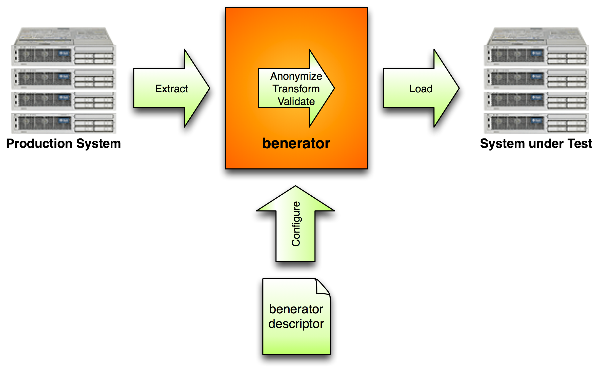

# Introduction to benerator 

## Goals 

The core goals of benerator are

*   Generation of data that satisfies complex data validity requirements

*   Efficient generation of large data volumes

*   Early applicability in projects

*   Little maintenance effort with ongoing implementation through configuration by exception

*   Wide and easy customizability

*   Applicability by non-developers

*   Intuitive data definition format

*   Satisfying stochastic requirements on data

*   Extraction and anonymization of production data

*   Supporting distributed and heterogeneous applications

*   Establishing a common data generation platform for different business domains and software systems

## Features 

### Data Synthesization 

Performance test data can be completely synthesized. A basic setup can be imported e.g. from DbUnit files, CSV files and fixed column width files. A descriptor file configures how imported data should be processed and adds completely synthesized data. The processed or generated data finally is stored in the system under test.

### Production Data Anonymization 

Production data can be easily extracted from production systems. Tables can be imported unmodified, filtered, anonymized and converted.

## State of the benerator 

benerator is developed and continuously extended and improved since June 2006\. benerator is mainly used and tested best for data file and database data generation, for these applications benerator should help you for almost all your data generation needs out of the box - and extending benerator for specific needs is easy.

XML-Schema, on the other hand, allows for an extraordinarily wide range of features. benerator's XML support is limited to features that are useful for generating XML data structures (no mixed content) and does not yet support all variants possible with XML schema. The elements `<unique>`, `<key>` and `<keyRef>` cannot be handled automatically, but require manual configuration. The following features are not yet implemented: `<group>`, `<import>`, `<all>` and `<sequence>` with minCount != 1 or maxCount != 1\. If you need support for some of these, please contact me.

## Building Blocks 

## Database Support 

All common SQL data types are supported (for a list of unsupported types, see ??? )

benerator was tested with and provides examples for

*   Oracle 19c (thin driver)

*   DB2

*   MS SQL Server

*   MySQL 5

*   PostgreSQL 12

*   HSQL 2.x

*   H2 1.2

*   Derby 10.3

*   Firebird