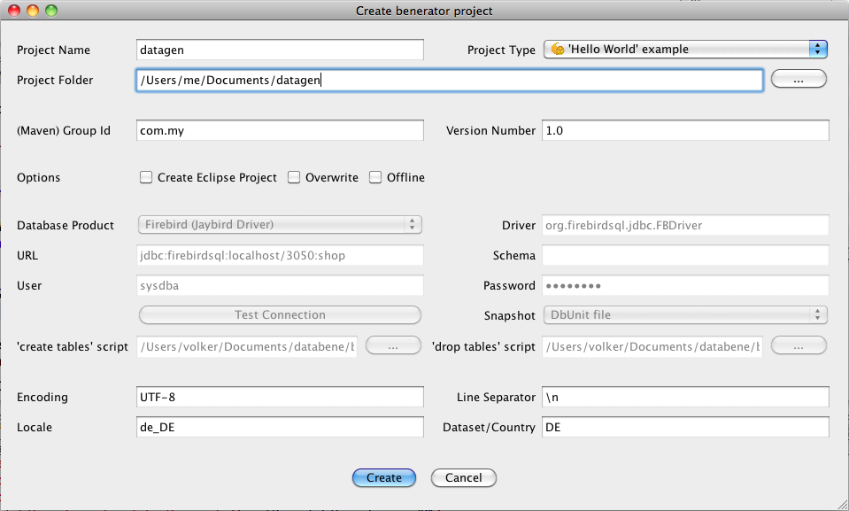

# The Benerator Project Wizard 

The Penerator Project Wizard helps you to easily and quickly set up any kind of Benerator project:

*   Descriptor file-driven data generation

*   XML Schema-driven XML file generation

*   Creation of database snapshots

## Starting the wizard 

Start the Project Wizard on the command line by typing

[on Windows:]

```shell
benerator-wizard
```

[or Mac/Unix/Linux/Solaris:]

```shell
benerator-wizard
```

Depending on your language settings, the GUI welcomes you with an English or German dialog (contributions of translations are welcome). You can override the default language settings by using Java's user.language system property, e.g.

```shell
benerator-wizard -Duser.language=en
```

The dialog looks like this:



## Configuring the project 

Enter the project name and choose an appropriate directory.

Then you can choose among a list of predefined project types:

*   **Hello World example**: Prints 'Hello World'-style output to the console

*   **Simple Project**: Simple project definition for custom generation projects

*   **Generate CSV file**: Defines generation of a simple CSV file

*   **Generate fixed column width file**: Defines generation of a simple fix column width file

*   **Generate Excel(TM) document**: Defines generation of a simple Excel(TM) file

*   **Populate database**: Small project that defines a database, creates a table and populates it

*   **Reproduce &amp; scale existing database**: Creates a snapshot of the current database content and creates a descriptor which replays the snapshot and defines templates for adding arbitrary volumes of data to each table.

*   **Shop example database**: Performs Definition and population of the databene shop database example for all database systems supported by Benerator: DB2, Derby, Firebird, HSQL, H2, Oracle, PostgreSQL and SQLServer.

*   **Generate simple XML file**: Defines generation of a simple XML file

*   **Create XML documents from XML Schema**: Uses an (annotated) XML Schema file for generating several XML files

*   **Create a database snapshot**: Configures database snapshot generation

*   **Write Benerator extensions**: Java project that provides you with sample implementations of Benerator's extension interfaces and makes them cooperate in a descriptor file.

You can optionally make the wizard create an Eclipse project configuration, too. This requires you to have Maven istalled.

If necessary, specify the database connection settings and test if they are right by clicking 'Test Connection'.

When reproducing an existing database or creating a database snapshot, choose a snapshot file format: 'DBUnit file', 'Excel(TM) document', or 'SQL file'. In all other cases, choose 'None'.

When reproducing an existing database, you need to provide Benerator with the DDL files for creating and dropping the related tables and sequences ('create tables' script and 'drop tables' script).

Finally you can explicitly choose system dependent settings. If you leave these fields empty, Benerator will always take the individual settings of the system it is executed on.

## Creating and running the project 

Finally press 'Create' for creating the project. The wizard then configures the project in the specified project folder.

Look into the project folder and read the readme.txt file. This contains individual instructions for your project: What further configuration steps are eventually necessary (e.g. proprietary database drivers), how to invoke Benerator for this special project type, and how to go on with customizations.

The easiest way to run the generated project is to run the Maven Benerator Plugin as described in the generated readme.txt files. The project wizard creates all necessary files for you to execute the created projects immediately (except for proprietary database drivers: Oracle or DB2). However you can also invoke Benerator directly from the command line, but have to take care of compiling custom Java classes in the project for yourself.